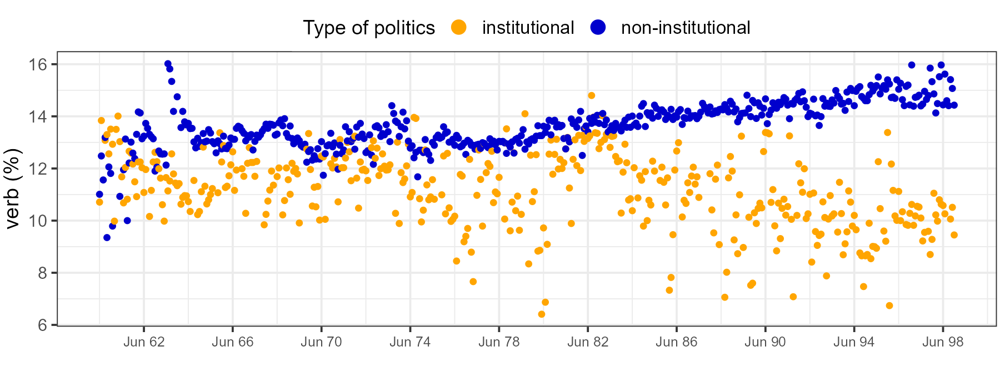

My research tracks the rhetoric of political actors. I argue that political rhetoric follows an actor's position relative to the boundaries of institutional politics. Outsiders use action-language to mobilize community resources, whereas insiders invoke a boundary-language to keep challengers out. When outsiders make it partway in — as major social movements have — a hybrid rhetoric emerges. Finally, a bureaucratic language sets in when outsiders are transformed into insiders.

To test this framework, I build original multilingual corpora. The dissertation corpus alone runs to roughly 750 million tokens of far-left and far-right movement periodicals alongside legislative speech across seven decades; other projects draw on congressional speech, broadcast and social media, and a new global corpus of insurgent texts.

I measure rhetoric through syntax, semantics, and emotions, and use causal designs such as synthetic control, instrumental variables, and difference-in-differences to identify how position relative to the institutional boundary changes the way actors speak.

Understanding how outsiders speak and how insiders respond rhetorically is central to a moment defined by contests over who belongs inside the political order. Tracking rhetoric across these positions offers a way to see those contests as they unfold.

## Job Market Paper

Why do political outsiders speak differently from politicians? Insurgents, revolutionaries, and activists usually enter the purview of researchers when they fight or mobilize. My dissertation asks instead how they talk and traces the difference to where they stand. Shut out of institutional politics, outsiders depend on the community for survival and reach community members through what I call action-language: a rhetorical style that turns political claims into calls for action.

If action-language is how outsiders ask, movement organizations have every incentive to use more of it — and often don't. That restraint is the dissertation's central puzzle, and I argue that power is what regulates it. Appeals to the community stay credible only when they match an organization's presence on the ground. Power travels through two channels. Community organizing makes the community and its resources legible, producing latent power — a capacity for future mobilization. Mobilization produces realized power, reflecting a record of past performance. Since mobilization is episodic and hard to repeat, latent power should shape rhetoric more strongly.

Turkey between 1960 and 1998 offers unusual leverage. Socialist and ethnic movements remained outsiders throughout, two military coups compressed the differences among them, and Syrian backing set the PKK's trajectory apart. I measure action-language through verb density in movement periodicals and parliamentary proceedings, across a corpus of one million pages. Outsiders use 2.33 percentage points more verbs than parliamentarians, a gap of roughly 23 percent. Synthetic control puts the PKK 1.78 percentage points above its counterfactual. Instrumental variables then separate the two channels, using administrative expansion to isolate legibility and temperature deviation to isolate attacks.

::: {#fig-verbs}
{fig-alt="Scatterplot of monthly verb density from 1960 to 1998. The non-institutional series sits consistently above the institutional series across the full period."}

**Outsiders use more verbs than legislators.** Monthly verb density, June 1960 – November 1998.
:::

The two channels diverge. Legibility raises verb use the following month; attacks do not, at any lag, which suggests movements calibrate on future potential rather than past record. These findings replicate across 300 periodicals and half a century, and in interwar America when the Ku Klux Klan is set against the U.S. Congress, making the results robust to organization, language, ideology, and political system. Taken together, they show that the boundaries of institutional politics structure political communication, a claim the rest of my agenda tests at other positions along those boundaries.

## Research Pipeline

My pipeline extends the dissertation into a broader theory of rhetorical adaptation, tracing rhetoric across every position relative to the institutional boundary — mobilizing outside it, defending it, negotiating along it, and crossing it. If outsider language revolves around "we must act," the standard institutional response is "don't let them in." Project A isolates the emotive rhetoric insiders use to keep challengers out. Project B asks what happens when that policing fails and finds a liminal rhetoric — "we must act, but we should also negotiate" — in movements granted partial access. Project C takes up the rarest case: what becomes of insurgent language after insurgents capture the state.

### Project A. Keeping them out: Emotive rhetoric of institutional insiders

*Institutional rejection · Far-right movements · American politics · Emotions · Text-as-data*

**Theoretical framework.** How do institutional actors respond when outsiders breach the boundaries of institutional politics? I argue that just as outsider status induces action-language for mobilization, insider status induces boundary-language aimed at defending those boundaries. Insiders invoke emotions such as disgust and contempt to portray challengers as morally illegitimate and politically dangerous. The project shows that a movement can remain institutionally rejected even as elements of its agenda enter the mainstream.

**Empirical strategy.** I test this argument using speeches by members of Congress, Fox News transcripts, and social media discussions by the conservative base surrounding the 2017 Unite the Right rally. Combining transformer-based emotion classification with difference-in-differences designs, the project evaluates whether leaders of the conservative establishment responded more strongly than its base to the alt-right's attempt to go mainstream. With the theory, data sources, and identification strategy fully specified, this is the first paper I will draft after the dissertation.

### Project B. One foot in, one foot out: The rhetorical transformation of U.S. women's, labor, and civil rights movements

*Institutional acceptance · Movements · American politics · Semantics · Text-as-data*

**Theoretical framework.** What happens to movement rhetoric when boundary policing fails and insiders are forced to compromise? I argue that a liminal rhetoric emerges in the immediate aftermath of institutional acceptance. It borrows from both the action-language of outsiders and the bureaucratic language of insiders as movements confront two pressures: the enforcement of newly gained rights and the growing divide between radicals and pragmatists. The hybrid grows out of partial institutional access and continued dependence on the community.

**Empirical strategy.** I test this argument using the women's, labor, and civil rights movements in the twentieth-century United States, each after a major legislative victory (19th Amendment, 1920; Wagner Act, 1935; Civil Rights Act, 1964). I first calculate polysemy scores for core movement verbs using RoBERTa. Higher scores indicate that the same verbs are being deployed across diverging semantic contexts, consistent with a hybrid register. I then run dynamic staggered difference-in-differences models to trace the rise and fall of liminal rhetoric in a three-year window after each victory. This is the first design-based study to identify a shared rhetorical form across canonical U.S. social movements.

### Project C. From outsider to insider: The rhetoric of insurgent-turned-government groups

*Regime change · Insurgency · Conflict · Political methodology · Text-as-data*

**Theoretical framework.** If political language reflects an actor's position relative to institutional boundaries, what happens when insurgent groups overthrow a regime and take control of the state? I argue that outsider rhetoric gives way to bureaucratic rhetoric once insurgents assume power. The mechanism is a shift in incentives: survival risks decline, institutional legitimacy becomes available, and continued mobilization may threaten regime stability. As insurgents become rulers, action-language should lose its distinctive role.

**Empirical strategy.** I identify winning and ongoing insurgencies in the Uppsala Conflict Data Program (1946–2024), then draw their texts from my *Insurgents Speak* corpus. Using staggered difference-in-differences designs, I estimate how rhetoric changes following government takeover. The project extends conflict scholarship on rebel governance beyond wartime rule, into the rhetorical afterlife of insurgencies that win. With case selection and research design complete, it offers a hard test of boundary-crossing.
